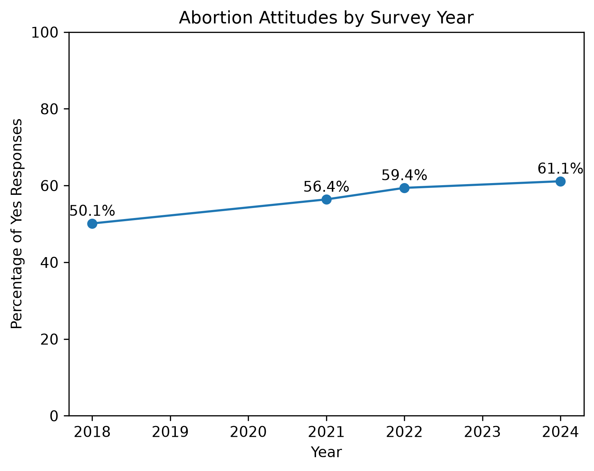
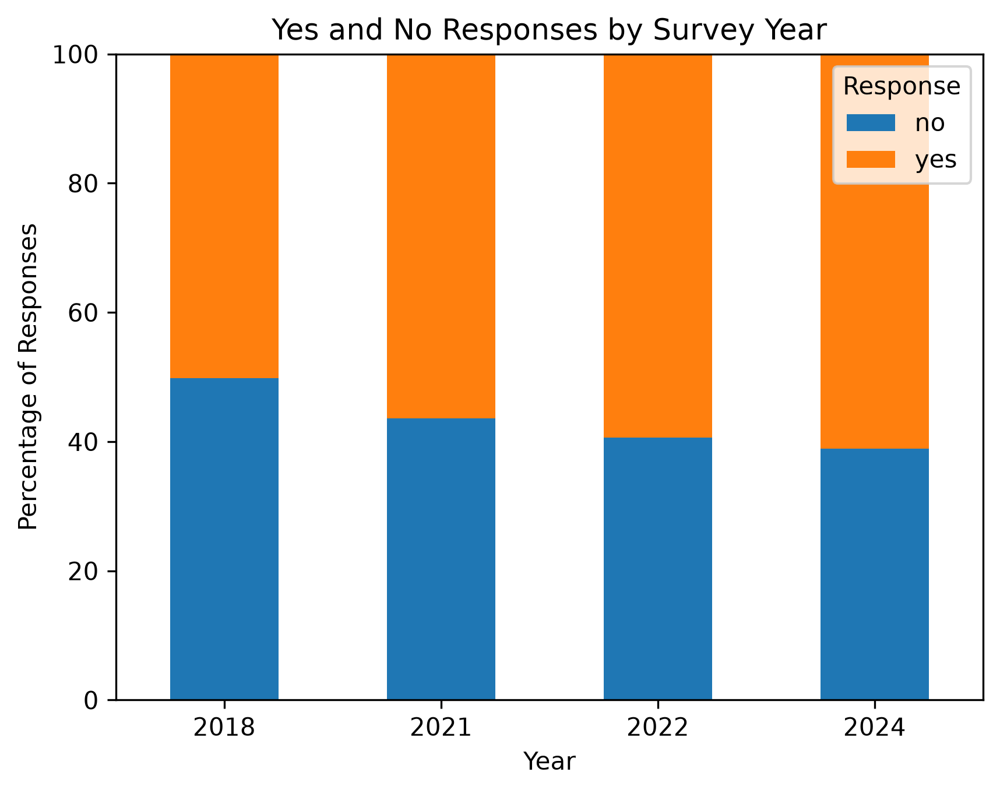

# GSS Abortion Attitudes Analysis

## Project Overview

This project analyzes responses to the General Social Survey (GSS) question `abany`, which asks whether a woman should be able to obtain a legal abortion if she wants one for any reason.

The analysis compares valid responses from the 2018, 2021, 2022, and 2024 GSS datasets to examine whether the distribution of responses differed across survey years.

Python was used to extract, clean, combine, summarize, and visualize the survey data. A chi-square test of independence was conducted in jamovi to test the association between survey year and response.

## Research Question

Is there a statistically significant association between survey year and responses to the GSS `abany` question among respondents with valid Yes or No responses?

## Data

### Data Source

The datasets used in this project were obtained from the General Social Survey (GSS), administered by NORC at the University of Chicago.

[GSS SPSS Data Files](https://gss.norc.org/get-the-data/spss.html)

Data were obtained from the General Social Survey (GSS) for the following survey years:

- 2018
- 2021
- 2022
- 2024

The variable analyzed was `abany`, which records responses to whether a woman should be able to obtain a legal abortion if she wants one for any reason.

Responses that were missing or were not coded as valid Yes or No responses were excluded from the analysis.

The final combined analytical dataset contained **6,777 valid responses**.

## Data Preparation

Python was used to:

- Read the original GSS `.sav` files using `pyreadstat`
- Extract the `abany` variable from each survey year
- Assign the corresponding survey year to each dataset
- Combine the four datasets using `pandas`
- Remove responses outside the valid Yes/No categories
- Export a cleaned CSV dataset for statistical analysis
- Calculate response percentages by year
- Generate reproducible visualizations using `matplotlib`

## Statistical Analysis

A chi-square test of independence was used to evaluate whether survey year and response to `abany` were statistically associated.

The null hypothesis (H₀) was that survey year and response were independent. The alternative hypothesis (H₁) was that survey year and response were associated.

The analysis produced:

**χ²(3) = 50.3, p < .001, N = 6,777**

Because the p-value was below the .05 significance level, the null hypothesis was rejected. The analysis found a statistically significant association between survey year and response to `abany`.

## Results

Among valid responses, the percentage answering **Yes** was:

| Survey Year | Yes | No | Valid N |
|-------------|----:|---:|--------:|
| 2018 | 50.1% | 49.9% | 1,524 |
| 2021 | 56.4% | 43.6% | 1,328 |
| 2022 | 59.4% | 40.6% | 1,345 |
| 2024 | 61.1% | 38.9% | 2,580 |
| **Total** | **57.4%** | **42.6%** | **6,777** |

Across the survey years included in this analysis, the observed percentage of valid respondents answering Yes was 50.1% in 2018, 56.4% in 2021, 59.4% in 2022, and 61.1% in 2024.

These results describe the observed responses and statistical association within the selected GSS datasets. This analysis does not establish why the response distribution differed across years or demonstrate that any particular event caused the observed differences.

## Visualizations

### Percentage Answering Yes by Survey Year

The following visualization displays the percentage of valid respondents answering Yes to `abany` for each survey year included in the analysis.

### Yes and No Responses by Survey Year

The 100% stacked bar chart displays the complete distribution of valid Yes and No responses within each survey year.

## Historical Context

In 2022, the U.S. Supreme Court issued its decision in *Dobbs v. Jackson Women's Health Organization*, overruling *Roe v. Wade* and *Planned Parenthood v. Casey*.

The 2022 decision is included here only as historical context for readers reviewing the survey years included in this project. This analysis does **not** test whether the *Dobbs* decision or any other political, legal, or social event caused the observed differences in survey responses.

For additional reference, the official U.S. Supreme Court opinion is available here:

[Dobbs v. Jackson Women's Health Organization, 597 U.S. 215 (2022)](https://www.supremecourt.gov/opinions/21pdf/19-1392_6j37.pdf)

## Limitations

This project has several limitations that should be considered when interpreting the results:

- The analysis includes only the 2018, 2021, 2022, and 2024 GSS survey years.
- Only respondents with valid Yes or No responses to `abany` were included.
- The analysis evaluates an association between survey year and response; it does not establish causation.
- Other demographic, social, political, or economic variables were not controlled for in this analysis.
- Differences in sample composition across survey years may influence the observed percentages.
- The results should be interpreted within the sampling design and methodology of the General Social Survey.

## Tools and Technologies

- **Python 3**
- **pandas** — data cleaning, transformation, and cross-tabulation
- **pyreadstat** — importing SPSS `.sav` files
- **matplotlib** — data visualization
- **jamovi** — chi-square analysis and contingency tables
- **Visual Studio Code** — Python development
- **GitHub** — project documentation and version control

## Repository Contents

- `GSS_Abortion_Analysis.py` — Python script used to process, combine, summarize, and visualize the GSS data
- `GSS_Abortion_Clean.csv` — cleaned analytical dataset containing survey year and valid `abany` responses
- `GSS_Abortion_Analysis.omv` — saved jamovi analysis containing the contingency table and chi-square test
- `Abortion_Attitudes_by_Year.png` — line graph of Yes-response percentages by survey year
- `Abortion_Responses_Stacked.png` — 100% stacked bar chart of Yes and No responses by survey year
- `README.md` — project documentation

## Summary

This project demonstrates a reproducible data-analysis workflow using multiple years of General Social Survey data. Python was used for data extraction, cleaning, combination, validation, descriptive analysis, and visualization, while jamovi was used to conduct and interpret the chi-square test of independence.

The final analytical dataset contained **6,777 valid responses**. The chi-square analysis found a statistically significant association between survey year and response to `abany`, **χ²(3) = 50.3, p < .001**.

This project demonstrates practical skills in data preparation, statistical analysis, visualization, interpretation, and reproducible research.
